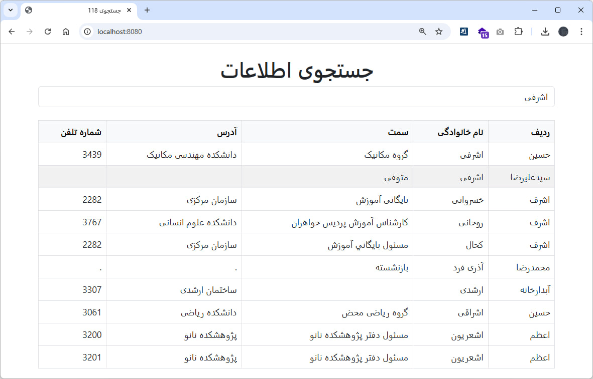
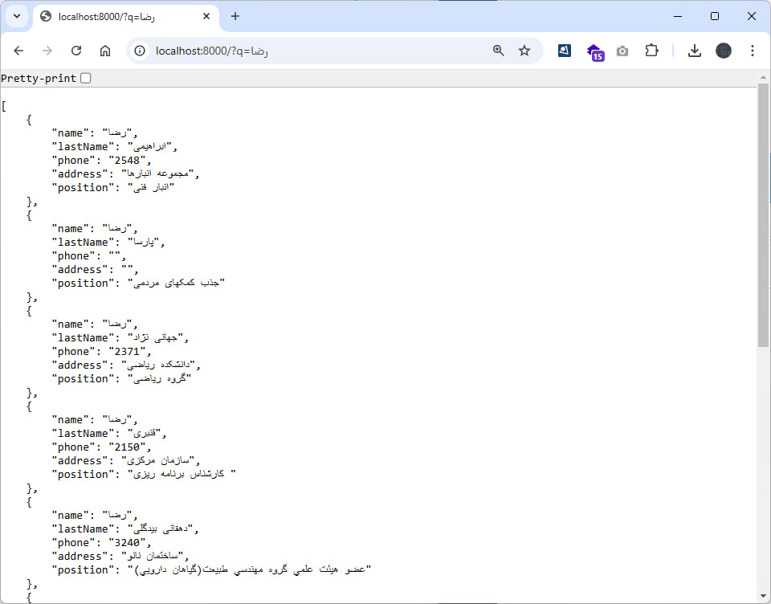

# Organization Phone 118

This project allows users to search for contact information in an organization using Meilisearch. The PHP application connects to a Meilisearch database and provides an API endpoint for querying contact data. The web interface enables users to perform searches and view results in a user-friendly table.

## Features

- Search functionality for contact data including name, last name, phone, address, and position.
- User-friendly web interface with RTL (Right-to-Left) support for Persian.
- Dockerized setup for easy deployment.

## Screenshots

|  |  |
|----------------------------------|----------------------------------|

## Prerequisites

- Docker and Docker Compose installed on your system.

## Setup Instructions

### 1. Clone the Repository

```bash
git clone <repository-url>
cd <repository-folder>
```

### 2. Add Environment Variables

Update the following values in `.env`:

- `MEILISEARCH_URL`: URL of the Meilisearch instance.
- `API_KEY`: Your Meilisearch API key.
- `INDEX_NAME`: Name of the index to query.

And run `composer install` and `composer dump-autoload`.

### 3. Start the Services

Run the following command to start the services:

```bash
docker-compose up --build
```

This will start:

- Meilisearch on port 7700.
- Front-end application on port 8080.
- Back-end application on port 8000.

### 4. Access the Application

- Open the browser at `http://localhost:8000` for the PHP application.
- Open the browser at `http://localhost:8080` for the Front-End application.
- Meilisearch is available at `http://localhost:7700`.

## API Endpoint

### Search Endpoint

**URL:** `/search`

**Method:** `GET`

**Query Parameters:**
- `q`: The search query string.

**Example Request:**

```bash
curl -X GET "http://localhost:8000/search?q=John"
```

**Example Response:**
```json
[
  {
    "name": "John",
    "lastName": "Doe",
    "phone": "123456789",
    "address": "123 Street Name",
    "position": "Manager"
  }
]
```

## Web Interface

The web interface is built with Bootstrap for styling and provides an intuitive search functionality. Users can enter a query in the search box and view results in a table format.

### Example Usage

1. Enter a search term in the input box.
2. Click the "جستجو" button.
3. View the results in the table below.

## File Structure

```
.
├── data/                # PHP extract and import scripts
├── frontend/            # PHP extract and import scripts
├── meili_data/          # Meilisearch data persistence
├── docker-compose.yml   # Docker Compose configuration
├── Dockerfile           # PHP Dockerfile
├── README.md            # Project documentation
├── api.php              # API application file
└── load.php             # Loading .env data
```

## License

This project is licensed under the MIT License. See the LICENSE file for details.

**Copyright 2024, Max Base**
